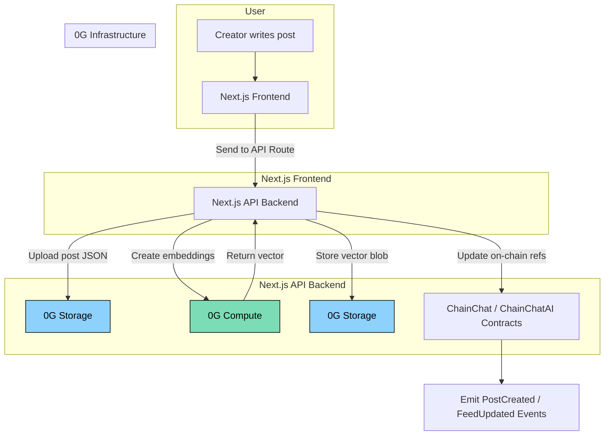

# ChainChatAI – AI-Powered Social dApp on OG Chain

## 📌 Problem Statement

Social interactions on the blockchain are still fragmented. While existing decentralized social platforms focus on feeds, tokens, or identity, they often lack **intelligent engagement**, **personalized experiences**, and **contextual discovery**. Users face challenges such as:

* Static interactions (posts, likes, comments) without real intelligence.
* Poor personalization — no smart recommendation or content understanding.
* Limited accessibility — gas and wallet UX hinder mass adoption.
* Lack of scalability — most dApps depend on external compute/storage providers, increasing cost and centralization risks.

---

## 💡 Proposed Solution: ChainChatAI

ChainChatAI is an **AI-powered decentralized social dApp** that leverages **OG Chain’s full infrastructure** — **compute, storage, and execution layer** — to create a **smarter, scalable, and user-friendly social experience**.

### 🔑 Key Features

* **AI-Powered Feeds & Recommendations** – Content is dynamically curated using OG’s **inference SDK**, enabling personalized timelines.
* **Smart AI Social Profiles** – Each user gets an **AI-enhanced profile** that can auto-generate posts, summarize conversations, and assist in engagement.
* **Decentralized AI Compute** – All inference runs on **OG Chain’s compute layer**, removing reliance on centralized AI providers.
* **On-Chain Storage Integration** – User posts, interactions, and embeddings are persisted using **OG’s decentralized storage**.
* **Gasless UX with Relayer** – Seamless onboarding via **Privy Embedded Accounts** + **backend relayer** (gas sponsored on behalf of users) till OG lauches their paymaster and account abstraction(AA) features.

---

## 🛠 Workflow & Architecture

1. **User Onboarding**

   * User signs in via **Privy EAO wallet** (no seed phrases).
   * Relayer (Next.js API) handles gas for smooth UX.

2. **Content Creation & Storage**

   * User posts content.
   * Content + embeddings stored on **OG Storage**.

3. **AI Inference & Personalization**

   * OG **Inference SDK** processes embeddings and generates summaries, suggestions, or recommendations.
   * AI-powered feed ranking runs entirely on **OG Compute**.

4. **Social Interactions**

   * Users can post, comment, like, and follow.
   * AI agents assist by summarizing long threads, and generating replies.

5. **Result**

   * A **fully decentralized AI social experience** where **OG Chain handles execution, compute, and storage**.

---

## 📊 Architecture Diagram

## Post Creation & Indexing

[](https://mermaid.live/edit#pako:eNqFVF1v2kAQ_CuryytQG8cFXKkSGIho1CSKy0txHg57ARf7Dp3P-Sjw37t3JikiDd0Ha3c9szs7CG9ZIlNkAVvk8ilZcaXhxzAWQFFW86XimxVMS1R1y0R_FirkWip4UpnGEjay1A_QbH6FwewGn3XrVwljJYVGkT7UPMpicTLVQF9hH_FMDMzoXURN0BL6dxO4l5XGHYRvLNMc8GT9_4UH1BmmidCunG5yyVN7HnyLbm92ELkz5woiup0v8R3e2oKAxRzTNBPLcgfXlhDKYkOKjwjXrmXco66UgEdMaCQddDrRbMLDa5jnck4S2uckTDepkSBFk37KTIDCBamIwlloSnpo-ARveX9C0oRWPNHlGd9uryZiobjZa5NSqyoh4cfrIzcIgrJWddRt_6t7bbBJ7cm7rZE9BEaPejYqMg135H5tbErSx4hpfWNKEBRWd01Mcl6WQ1zAYR8ssjwPLrqjoTsOG6RZrjG4cBynkchcKpt-OaEeRB2oncEwHPgfU1mDLVWWsoD8wAYrUBXclGxrxsZMr7DAmAWUplytYxaLPXE2XPyUsnilKVktVyxY8LykqrLHDTNO1v-FkD-oQlkJzQLX9-wMFmzZM5WO13LavZ7T6_j-Zbvr-Q32wgLfaV16Hd9xXK_rf-50vX2D_bZbnVa3QxhMM_Lpe_3ft5-A_R-whUO5)

### Explanation
* Frontend sends content → API stores raw post on 0G Storage and gets a CID.
* API calls 0G Compute to get an embedding; stores vector (or shard) on 0G Storage.
* Contract is updated with the raw post CID and (optionally) the vector CID, and emits events.

---
  
## Personalized Feed Generation

[](https://mermaid.live/edit#pako:eNptU8Fy2jAQ_ZUdXQvECXEBHzoTDLQ0LWUg4VDDQdhrrMaWGEkmoZh_78okhWmqg2d35-17u0_WgcUqQRawNFfPcca1hYfBUgIdU643mm8zWAh8Rn0quvMYPRrUoLYoDXxRBcIIMVlBs_kJRsNogi-29cvASCtpUSarUydFS_kPc5_HT1T_23I3Hb_VVme90dBRVyO0cQalk05JD7ZKEL-uYB5GYcaFpI-9G0NIsprH9oJhHtYMM7SllhCOBxX0h5FT02hUvkPjiqAkeJ9hbpXmG7xo758G-KZ48iqtVSpyhCZFmBr4cBoLizUmiZCbCqaR8wSmr8Cv8x-T94Qhl4lIuEXaxVhDdOs9TRSjjPdXqcrpSq4ybjLLNwYqcHATTQkK44F5T9fnzqC0tmmHMa1hKljMo_NOsKjL0M_V-j8EMy6faAgjCpFzLeyeFkvJoUyicUsaFQueVzC7jxyUFoU56p2IL82a3ddcD2oLk4ru7uL2WYNttEhYYHWJDVagLrhL2cGBlsxmWOCSBRQmXD8t2VIeqWfL5U-lirc2rcpNxoKU54aycusMHAhOf9QZQnKoQ1VKy4Jrv1NzsODAXij12i3vptfzeh3fv73ptv0G27PA91q37Y7vedftrv-x020fG-x3req1uh3CYCLIuu-n11I_muMfwBsEVQ)

### Explanation
* Contract stores the user’s feedPointer (CID).
* API loads that JSON (preferences, user vector).
* It gathers candidate posts (recent, from follows, trending), fetches embeddings, computes scores, and returns a ranked list.

---

## Smart Contract Interactions (social + AI pointers)

[](https://mermaid.live/edit#pako:eNplUkuP2jAQ_iujOfTEI5DNAjlUigwrRepWiF1VqyYc3Hgg7iY2sp2WLfDf6yRFS9s5WB7re8xnzQkLLQhj3FX6Z1Fy4-B5mSvwZZtve8MPJTwYrRwp0T-3lWRrbd34k3ylMdN1TcqNV0I6WBu9kxVtYTj8CMkm-0xHN_puIVmnMIQNVfyNzLYX6hT_sWIll-rGZ9MKnXuegOcXGO65rcjaMzCWdWh_OGB-QsMLt_2P-0QOdkRiXPucFbB0eYYkfacmKayOPp2VWt2wGesirL5MsiddSF7B6odPaW8N0j-QafbQGjx2Bn_BbiJ6pQ6eLl-yVAk6koFK2tYZPkBzENyRhYIXJV3ZXvlKyRUOcG-kwNiZhgZYk6l52-KpBefoSqopx9hfBTevOebq4jkHrr5qXV9pRjf7EuMdr6zvetel5P7z3yF-aDJMN8phPLmfdBoYn_Do2yAcBdPFIljMouhuOg-jAb5hHAWju3AWBcEknEf3s3l4GeCvzjUYzWceQ343tHnsN61buMtvM-rB_Q)

### Explanation
* ChainChat: posts, likes, comments, profiles, rewards.
* ChainChatAI: feedPointer + model/embedding CIDs per user.
* Indexer/worker watches events to keep caches hot (for snappy feeds).

---

Perfect catch — let’s reshape everything around **ChainChatAI as an AI-powered social dApp** (not a chatbot). Below is a **hackathon-ready submission pack** you can drop into your repo. It includes: detailed problem/solution, feature set, clear narratives around each diagram, mockups/wireframes guidance, and a tight pitch.

---

# 🧩 ChainChatAI — AI-Powered Social dApp on 0G

## 🚨 Problem Statement

Modern social feeds are:

1. **Opaque & centralized** — A few companies control ranking algorithms; users can’t inspect, port, or tune them.
2. **Low signal / high spam** — Discovery is noisy; creators struggle to reach the right audience.
3. **High friction** — Wallet setup, gas, and on-chain UX scare mainstream users away.
4. **Data silos** — Your interests, embeddings, and “you” are not portable across apps.

## 💡 Solution (What we’re building)

**ChainChatAI** is a decentralized social app where **feeds are powered by AI and owned by users**. It runs fully on the **0G stack**:

* 🔑 **User-owned AI feeds**: Each user has a feed profile (embeddings, preferences, filters) stored on **0G Storage**; a pointer (CID) is anchored on-chain.
* 🧠 **AI ranking, summaries & moderation**: Posts are embedded and ranked via **0G Compute**; safety/moderation runs there too.
* ⚡ **Gasless UX**: **Privy EAO wallet** + **Next.js API relayer** covers gas on the user’s behalf (until 0G paymasters arrive).
* 💬 **Social core**: Profiles, posts, images, likes, comments, shares — with ccToken incentives (already in your contracts).
* 🔌 **Open, portable algorithms**: Users can export/import their feed pointers; devs can plug in alternative ranking services.
* 🔍 **Transparent telemetry**: Feed explains *why* items ranked high (similarity score, freshness, follows, etc.).

---

## 🧩 Feature Set (MVP → Nice-to-Have)

**MVP**

* Create profile; set interests.
* Create posts (text + image), like, comment, share.
* Post & user **embeddings** via 0G Compute.
* Personalized **feed ranking** (similarity + recency + social graph).
* **User feed pointer** stored on-chain (CID to 0G Storage JSON).
* Gasless interactions via Privy EAO + relayer.

**Phase 2**

* Generative **summaries**, **hashtags/tags**, **translations**.
* **Moderation** (NSFW/hate spam) with adjustable community filters.
* **Explain-my-feed** overlays (why this post).
* Creator **tips** / boosts in CCT; reward splits.
* **Model marketplace**: users choose between ranking recipes.

---

## 🔄 Architecture & Workflow

### 1) Post Creation & Indexing (end-to-end)

> What happens when a creator posts? We embed the content, store vectors, and update the on-chain pointers that fuel discovery.



**Explanation:**

* Frontend sends content → API stores raw post on **0G Storage** and gets a CID.
* API calls **0G Compute** to get an embedding; stores vector (or shard) on **0G Storage**.
* Contract is updated with the raw post CID and (optionally) the vector CID, and emits events.

---

### 2) Personalized Feed Generation (read path)

> How a user’s home feed is built using their **user-owned AI feed profile**.

```mermaid
flowchart TD
    subgraph Viewer
        U[User opens Home Feed] --> FE[Next.js Frontend]
    end

    subgraph Backend[Next.js API Backend]
        FE -->|Fetch user feed pointer| SC[ChainChatAI Contract]
        SC -->|Return CID| BE[API resolves CID on 0G Storage]
        BE -->|Load feed profile (prefs + user embedding)| P[Feed Profile JSON]
        BE -->|Candidate posts (by recency/follow/hashtags)| Cands[Post IDs]
        BE -->|Batch fetch vectors| VS[0G Storage Vector Blobs]
        BE -->|Rank (similarity + freshness + social)| RK[Ranking Service]
        RK -->|Top N| FE
    end
```

**Explanation:**

* Contract stores the user’s **feedPointer** (CID).
* API loads that JSON (preferences, user vector).
* It gathers candidate posts (recent, from follows, trending), fetches embeddings, computes scores, and returns a ranked list.

---

### 3) Smart Contract Interactions (social + AI pointers)

> What your contracts do in this system, beyond social actions.

```mermaid
flowchart TD
    subgraph Frontend
        A[Post/Like/Comment/Edit Profile] --> AR[Next.js API (Relayer)]
    end

    subgraph Chain
        AR -->|Relayed TX (gasless)| CC[ChainChat Contract]
        AR -->|Set feed/model CID| AI[ChainChatAI Extension]
        CC --> EV1[Social Events]
        AI --> EV2[Feed/Model Events]
    end

    EV1 --> IDX[Indexer listens & updates caches]
    EV2 --> IDX
```

**Explanation:**

* **ChainChat**: posts, likes, comments, profiles, rewards.
* **ChainChatAI**: `feedPointer` + model/embedding CIDs per user.
* Indexer/worker watches events to keep caches hot (for snappy feeds).

---

## 🗂️ Data Shapes sample(stored on 0G Storage)

**User Feed Profile (CID set via `updateUserFeed`)**

```json
{
  "version": "1.0",
  "user": "0xUSER",
  "embedding_cid": "bafy...uservec",
  "interests": ["ai", "gaming", "memes"],
  "weights": { "similarity": 0.6, "recency": 0.25, "social": 0.15 },
  "safety": { "nsfw": "hide", "hate": "hide", "spam": "downrank" },
  "blocked_terms": ["spoilers"],
  "explanations": true,
  "updated_at": 1723948800
}
```

**Post Embedding Doc**

```json
{
  "version": "1.0",
  "post_id": 1234,
  "author": "0xCREATOR",
  "content_cid": "bafy...rawpost",
  "embedding": [/* float32[] or pointer to vector shard */],
  "lang": "en",
  "tags": ["ai", "builder"],
  "timestamp": 1723948800
}
```

---


## Short Description

**ChainChatAI is the first AI-powered social dApp built entirely on OG Chain, leveraging its compute, storage, and execution layers.**
It creates personalized, intelligent, and decentralized social experiences powered by AI — without relying on external providers.

* Built on **OG Chain**.
* Uses **OG Storage** for persistence.
* Uses **OG Compute (Inference SDK)** for AI inference.
* Onboards users with **Privy wallets** + **relayer** for gasless UX.

👉 **In short:** ChainChatAI = **AI-powered decentralized social experience, fully OG-native.**

---

